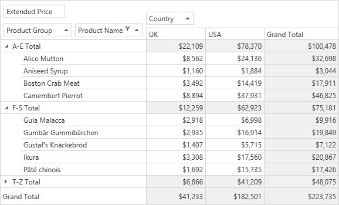

<!-- default badges list -->

<!-- default badges end -->

# Pivot Grid for WPF - Custom Group Intervals

This example shows how to implement custom group intervals in Pivot Grid to group axis values.

<!-- default file list -->
## Files to Look at

* [MainWindow.xaml](./CS/HowToCustomGroupInterval/MainWindow.xaml) (VB: [MainWindow.xaml](./VB/HowToCustomGroupInterval/MainWindow.xaml))
* [MainWindow.xaml.cs](./CS/HowToCustomGroupInterval/MainWindow.xaml.cs) (VB: [MainWindow.xaml.vb](./VB/HowToCustomGroupInterval/MainWindow.xaml.vb))
<!-- default file list end -->

## Overview

The _Product Groups_ calculated field is bound to the following expression:

`Iif(Substring([fieldProductName], 0, 1) &lt; 'F', 'A-E', Substring([fieldProductName], 0, 1) &lt; 'T', 'F-S', 'T-Z')`

The expression groups the _Product Name_ field's values into three large ranges: A-E, F-S, and T-Z according to product's start characters.

## Documentaton

[Grouping](https://docs.devexpress.com/WPF/8061/controls-and-libraries/pivot-grid/data-shaping/grouping)

## More Examples

[Pivot Grid for WPF - How to Group Date-Time Values](https://github.com/DevExpress-Examples/how-to-group-date-time-values-e2131)

